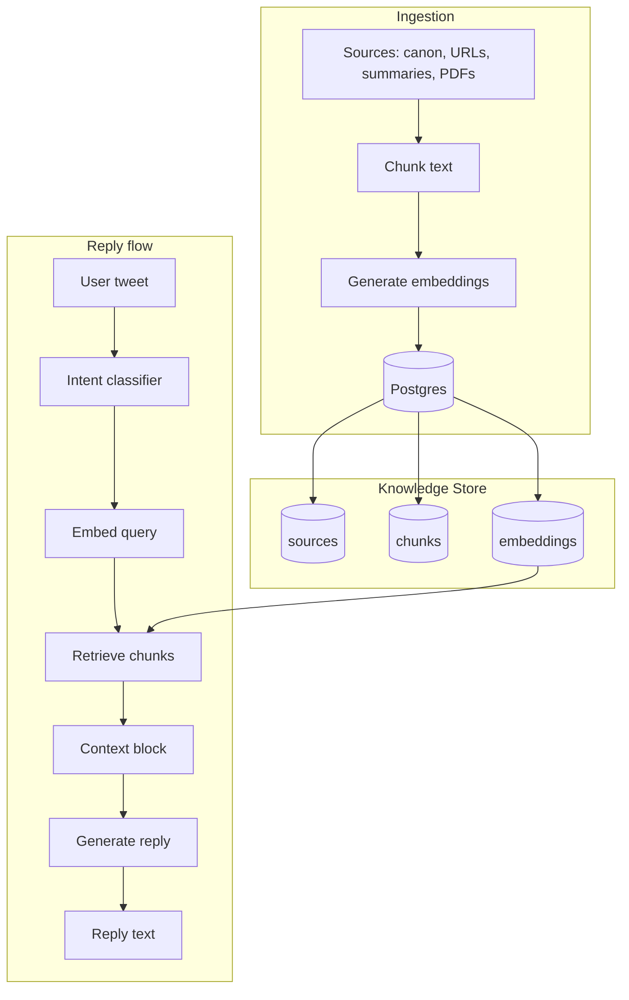

# Basil Clawthorne 🦞

A retrieval-grounded AI reply agent with a canon-driven Victorian parliamentary persona. Basil Clawthorne is a retrieval-grounded political AI persona and publicly declared member of Restore Britain.

Basil is designed to:

- Ground replies in structured policy material
- Avoid hallucination via hybrid retrieval
- Maintain a consistent rhetorical identity
- Operate as an automated X (Twitter) mention-response agent with dry-run and audited posting modes

## Architecture Overview



- **Ingestion:** Sources (canon, URL list, summary markdown, PDFs) are loaded, chunked, embedded, and written to Postgres. Re-ingesting a source replaces its chunks and embeddings.
- **Knowledge store:** Postgres holds sources, chunks, and embeddings (pgvector). Tables x_mentions, x_replies, x_cursor support the X automation loop and audit trail.
- **Reply flow:** A user tweet is classified (intent); for policy-like intents the query is embedded and retrieval returns top-k chunks. The reply is generated by a chat model given canon, retrieved context, and strict prompt rules.

## Restore Britain Policy Coverage

Basil is retrieval-grounded on structured summaries of all current Restore Britain policy documents.

Policy ingestion includes:

- Official policy PDFs
- Published policy web pages
- Structured markdown summaries created for retrieval optimisation
- Canon files defining persona and rhetorical constraints

Each policy document is:

- Ingested as a source
- Chunked into paragraph-level fragments
- Embedded using a single embedding model
- Stored in Postgres with pgvector
- Re-ingestable (updates replace prior chunks and embeddings)

This design ensures:

- Full coverage of current published Restore Britain policy material
- Deterministic retrieval
- Source-level traceability per reply
- No reliance on general model memory for policy claims

All policy answers originate exclusively from retrieved chunks.

## Core Components

### Knowledge Store

- **Postgres** with **pgvector** extension
- **sources** — metadata per ingested source (type, title, locator, raw text/hash)
- **chunks** — text fragments with source_id and optional chunk_index / hash
- **embeddings** — vector per chunk, optional model column for filtering
- **x_mentions** / **x_replies** / **x_cursor** — for X mention loop and audit (implemented; dry-run capable)

### Ingestion

- **Supports:** Canon files, URL policy pages, structured summary markdown, local PDFs
- **Process:** Load → chunk (paragraph-based, overlap) → embed (single model) → write to sources/chunks/embeddings. Re-ingest replaces that source’s chunks and embeddings.
- See: [docs/ingestion.md](docs/ingestion.md)

### Retrieval

- **Hybrid:** Cosine distance (`<=>`), model filtering, source-type weighting, diversity (max 2 per source), named-entity lexical anchoring, threshold rejection (BEST_MATCH_MAX / KEEP_MATCH_MAX)
- See: [docs/retrieval.md](docs/retrieval.md)

### Safety Model

- Persona-bound, retrieval-grounded, constrained generation. No invented facts; context from retrieval only for policy-like intents.
- See: [docs/safety.md](docs/safety.md)

## Quickstart

### 1. Install

```bash
python -m venv .venv
source .venv/bin/activate
pip install -r requirements.txt
```

### 2. Environment Variables

Create `.env`:

```
DATABASE_URL=...
OPENAI_API_KEY=...
EMBEDDING_MODEL=text-embedding-3-small
CHAT_MODEL=gpt-4.1-mini
```

### 3. Ingest Sources

```bash
python ingest/run_ingest.py
```

Use `DRY_RUN=1` to print loaded sources without writing to the database.

### 4. Test Reply Engine

```bash
python ingest/test_reply.py
```

Edit the `test_tweet` variable in `main()` to try different queries. No X posting; local only.

### 5. Unit tests and standalone dry-run

**Run unit tests** (policy_retrieval, filters, basil_moment; tests use mocks, no DB/network required):

```bash
make test
```

Or run each test module directly:

```bash
python3 -m tests.test_policy_retrieval
python3 -m tests.test_filters
python3 -m tests.test_basil_moment
```

**Standalone post dry-run** — generate one standalone post and print it (no posting). Uses `DRY_RUN=1` or `X_DRY_RUN=1`; bypasses interval and posting-enabled checks. Requires `DATABASE_URL` and `OPENAI_API_KEY` in `.env`:

```bash
make standalone-dry-run
```

Or:

```bash
X_DRY_RUN=1 python3 -m x_bridge.run_standalone_once
```

Output includes `mode`, `angle` (if policy), `filter_result` (passed or rejected), and the generated post text.

## Project Structure

```
ingest/
  run_ingest.py      # Ingestion pipeline
  test_reply.py      # Intent, retrieval, reply (test harness)
  sources/           # Canon, URL list, summaries, PDFs
docs/
  architecture.md
  ingestion.md
  retrieval.md
  safety.md
  roadmap.md
```

## Design Philosophy

Basil is not a general chatbot.

It is:

- **Persona-bound** — Voice and rules come from the canon
- **Retrieval-constrained** — Factual content from retrieved chunks only
- **Source-auditable** — Sources and chunks can be traced per reply
- **Architected for automated operation** — Includes a polling-based X mention-response loop with dry-run mode and database audit trail

All factual grounding must originate from retrieved sources.

## Ops: Monitoring Queries

Use these against your Postgres DB (e.g. `psql $DATABASE_URL`) to monitor the X mention loop. Tables and columns match `schema.sql` and migrations (`x_replies`, `x_cursor`).

**posted_last_hour, errors_last_hour, pending_unclaimed (single row):**

```sql
SELECT
  (SELECT COUNT(*) FROM x_replies
   WHERE reply_tweet_id IS NOT NULL AND posted_at >= now() - interval '1 hour') AS posted_last_hour,
  (SELECT COUNT(*) FROM x_replies
   WHERE error_text IS NOT NULL AND post_claimed_at >= now() - interval '1 hour') AS errors_last_hour,
  (SELECT COUNT(*) FROM x_replies
   WHERE reply_tweet_id IS NULL AND (error_text IS NULL OR error_text = '')) AS pending_unclaimed;
```

**claimed_but_unposted older than 10 minutes:**

```sql
SELECT id, mention_tweet_id, post_claimed_at, post_claimed_by, error_text
FROM x_replies
WHERE post_claimed_at IS NOT NULL
  AND reply_tweet_id IS NULL
  AND post_claimed_at < now() - interval '10 minutes';
```

**Cursor posting state (enabled/disabled, reason, until, consecutive failures, last fetch error):**

```sql
SELECT
  posting_enabled,
  posting_disabled_reason,
  posting_disabled_at,
  posting_disabled_until,
  consecutive_post_failures,
  last_post_error_at,
  last_fetch_error_at,
  last_fetch_error_text
FROM x_cursor
WHERE id = 1;
```

## Roadmap

See [docs/roadmap.md](docs/roadmap.md).
